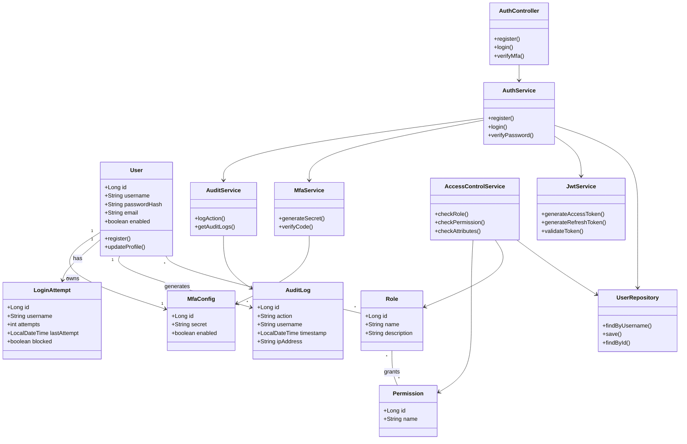

# Class Diagram — University IAM Platform

```mermaid
classDiagram
    class User {
        +Long id
        +String username
        +String passwordHash
        +String email
        +boolean enabled
        +register()
        +updateProfile()
    }

    class Role {
        +Long id
        +String name
        +String description
    }

    class Permission {
        +Long id
        +String name
    }

    class AuditLog {
        +Long id
        +String action
        +String username
        +LocalDateTime timestamp
        +String ipAddress
    }

    class LoginAttempt {
        +Long id
        +String username
        +int attempts
        +LocalDateTime lastAttempt
        +boolean blocked
    }

    class MfaConfig {
        +Long id
        +String secret
        +boolean enabled
    }

    class AuthService {
        +register()
        +login()
        +verifyPassword()
    }

    class JwtService {
        +generateAccessToken()
        +generateRefreshToken()
        +validateToken()
    }

    class MfaService {
        +generateSecret()
        +verifyCode()
    }

    class AccessControlService {
        +checkRole()
        +checkPermission()
        +checkAttributes()
    }

    class AuditService {
        +logAction()
        +getAuditLogs()
    }

    class UserRepository {
        +findByUsername()
        +save()
        +findById()
    }

    class AuthController {
        +register()
        +login()
        +verifyMfa()
    }

    User "*" -- "*" Role : has
    Role "*" -- "*" Permission : grants
    User "1" --> "*" AuditLog : generates
    User "1" --> "*" LoginAttempt : has
    User "1" --> "1" MfaConfig : owns

    AuthController --> AuthService
    AuthService --> UserRepository
    AuthService --> JwtService
    AuthService --> MfaService
    AuthService --> AuditService
    MfaService --> MfaConfig
    AccessControlService --> UserRepository
    AccessControlService --> Role
    AccessControlService --> Permission
    AuditService --> AuditLog
```
