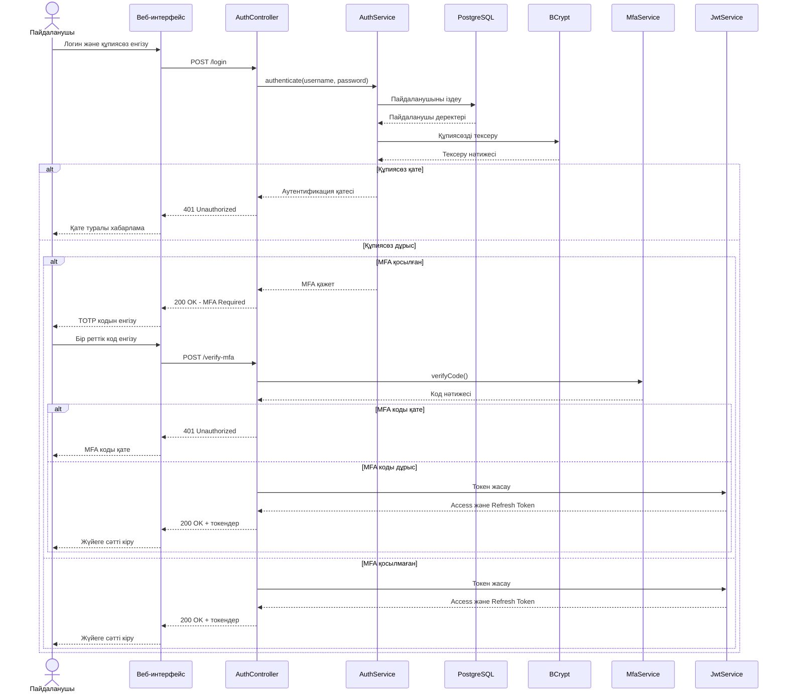

```mermaid
sequenceDiagram
    actor User as Пайдаланушы
    participant UI as Веб-интерфейс
    participant AC as AuthController
    participant AS as AuthService
    participant DB as PostgreSQL
    participant BC as BCrypt
    participant MFA as MfaService
    participant JWT as JwtService

    User->>UI: Логин және құпиясөз енгізу
    UI->>AC: POST /login
    AC->>AS: authenticate(username, password)
    AS->>DB: Пайдаланушыны іздеу
    DB-->>AS: Пайдаланушы деректері
    AS->>BC: Құпиясөзді тексеру
    BC-->>AS: Тексеру нәтижесі

    alt Құпиясөз қате
        AS-->>AC: Аутентификация қатесі
        AC-->>UI: 401 Unauthorized
        UI-->>User: Қате туралы хабарлама

    else Құпиясөз дұрыс
        alt MFA қосылған
            AS-->>AC: MFA қажет
            AC-->>UI: 200 OK - MFA Required
            UI-->>User: TOTP кодын енгізу
            User->>UI: Бір реттік код енгізу
            UI->>AC: POST /verify-mfa
            AC->>MFA: verifyCode()
            MFA-->>AC: Код нәтижесі

            alt MFA коды қате
                AC-->>UI: 401 Unauthorized
                UI-->>User: MFA коды қате

            else MFA коды дұрыс
                AC->>JWT: Токен жасау
                JWT-->>AC: Access және Refresh Token
                AC-->>UI: 200 OK + токендер
                UI-->>User: Жүйеге сәтті кіру
            end

        else MFA қосылмаған
            AC->>JWT: Токен жасау
            JWT-->>AC: Access және Refresh Token
            AC-->>UI: 200 OK + токендер
            UI-->>User: Жүйеге сәтті кіру
        end
    end
```
