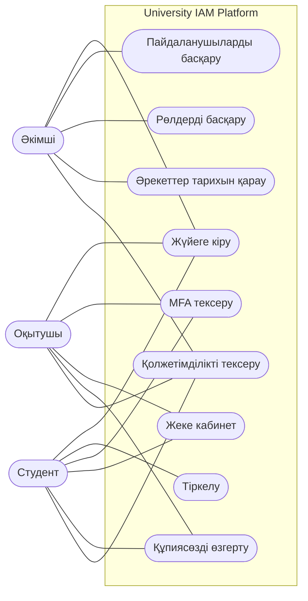

```mermaid
flowchart LR
    Admin(["Әкімші"])
    Teacher(["Оқытушы"])
    Student(["Студент"])

    subgraph IAM["University IAM Platform"]
        direction TB
        A(["Жүйеге кіру"])
        B(["Тіркелу"])
        C(["MFA тексеру"])
        D(["Пайдаланушыларды басқару"])
        E(["Рөлдерді басқару"])
        F(["Жеке кабинет"])
        G(["Қолжетімділікті тексеру"])
        H(["Әрекеттер тарихын қарау"])
        I(["Құпиясөзді өзгерту"])
    end

    Admin --- A
    Admin --- D
    Admin --- E
    Admin --- H
    Admin --- G

    Teacher --- A
    Teacher --- C
    Teacher --- F
    Teacher --- I
    Teacher --- G

    Student --- A
    Student --- B
    Student --- C
    Student --- F
    Student --- I
    Student --- G
```
