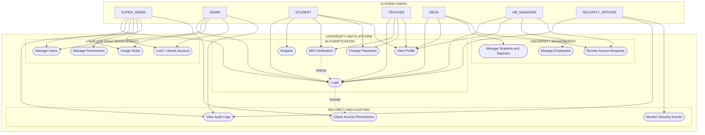

# Use Case Diagram — University IAM Platform

```mermaid
flowchart TB
    subgraph USERS["SYSTEM USERS"]
        direction LR
        SA["SUPER_ADMIN"]
        AD["ADMIN"]
        ST["STUDENT"]
        TE["TEACHER"]
        DE["DEAN"]
        HR["HR_MANAGER"]
        SO["SECURITY_OFFICER"]
    end

    subgraph SYSTEM["UNIVERSITY IAM PLATFORM"]
        direction TB

        subgraph AUTH["AUTHENTICATION"]
            UC1(["Login"])
            UC2(["Register"])
            UC3(["MFA Verification"])
            UC4(["Change Password"])
            UC5(["View Profile"])
        end

        subgraph ADMINISTRATION["USER AND ROLE MANAGEMENT"]
            UC6(["Manage Users"])
            UC7(["Assign Roles"])
            UC8(["Manage Permissions"])
            UC9(["Lock / Unlock Account"])
        end

        subgraph UNIVERSITY["UNIVERSITY MANAGEMENT"]
            UC10(["Manage Students and Teachers"])
            UC11(["Manage Employees"])
            UC12(["Review Access Requests"])
        end

        subgraph SECURITY["SECURITY AND AUDITING"]
            UC13(["View Audit Logs"])
            UC14(["Monitor Security Events"])
            UC15(["Check Access Permissions"])
        end
    end

    SA --> UC1
    SA --> UC6
    SA --> UC7
    SA --> UC8
    SA --> UC9
    SA --> UC13
    SA --> UC15

    AD --> UC1
    AD --> UC6
    AD --> UC7
    AD --> UC9
    AD --> UC13

    ST --> UC1
    ST --> UC2
    ST --> UC3
    ST --> UC4
    ST --> UC5

    TE --> UC1
    TE --> UC3
    TE --> UC4
    TE --> UC5

    DE --> UC1
    DE --> UC5
    DE --> UC10
    DE --> UC12

    HR --> UC1
    HR --> UC5
    HR --> UC11
    HR --> UC12

    SO --> UC1
    SO --> UC13
    SO --> UC14

    UC1 -.->|include| UC15
    UC3 -.->|extend| UC1
```
